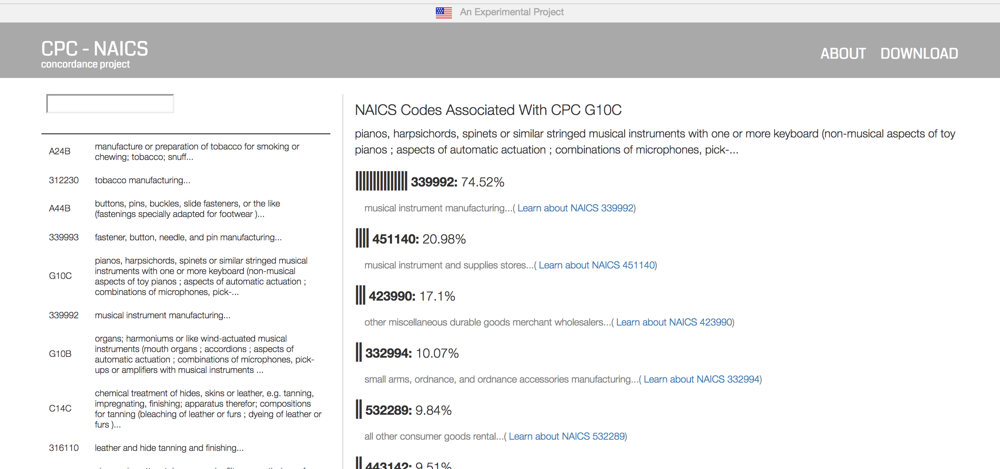

# CPC - NAICS Concordance
### A project of the US Patent + Trademark Office and the Commerce Data Service

#### Goal
An experimental project to develop a NLP-based cross-walk between the Cooperative Patent Classification (CPC) codes and the North American Industry Classification System (NAICS). By developing a concordance between the two systems, it becomes possible to contextualize the growth in innovative and intellectual activity (e.g. patents) from the economic industry perpsective, such as the number of patents that were awarded in a specific manufacturing industry. 

As a first step, [the web app](https://commercedataservice.github.io/cpc-naics/) recommended classification matches, denoting the strength of the match in terms of a percent value and a rudimentary horizontal bar graph. 

#### Roadmap
- April 2017: Development of prototype to link CPC to NAICS using basic NLP techniques such as n-grams (1/2/3/skip) and normalized cosine similarities.
- May 2017: Develop v1 web app, add keyword tags to illustrate what is being picked up upon in NLP process
